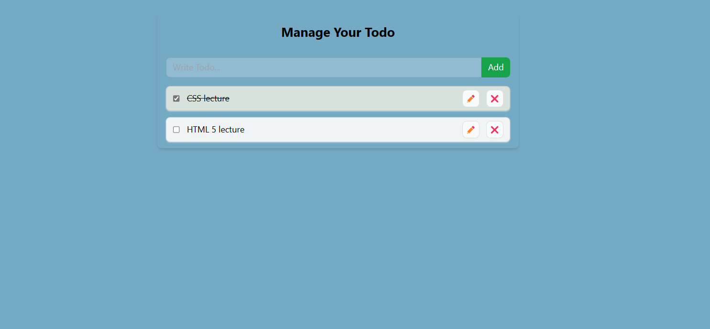

# React Todo Application

This is a simple Todo application built using React. It allows you to add, edit, delete, and mark todos as complete.


## Demo

You can check out a live demo of the application [here](#).

## Features

- Add new todos with a title.
- Edit existing todos.
- Delete todos.
- Mark todos as complete.
- Responsive design for various screen sizes.

## Getting Started

### Prerequisites

Before you begin, ensure you have the following installed on your machine:

- Node.js: [Download it here](https://nodejs.org/)

### Installation

1. Clone the repository:

   ```
   git clone https://github.com/LovelySehotra/Project/tree/main/ToDo/ToDoAndLocal
   ```

# Functions

1. `addTodo`:
   - Functionality: Adds a new todo item to the list.
   - Usage: Called when a new todo is submitted.

2. `updateTodo`:
   - Functionality: Updates an existing todo item.
   - Usage: Called when a todo item is edited and saved.

3. `deleteTodo`:
   - Functionality: Deletes a todo item.
   - Usage: Called when a user clicks on the delete button for a todo item.

4. `toggleComplete`:
   - Functionality: Toggles the completion status of a todo item.
   - Usage: Called when a user clicks on the checkbox for a todo item.

# Features

1. **Create a New Todo**:
   - Users can create a new todo item by entering a title and clicking the "Add" button.

2. **Edit Todo**:
   - Users can edit an existing todo item by clicking the edit icon (✏️) and making changes to the title.

3. **Delete Todo**:
   - Users can delete a todo item by clicking the delete icon (❌).

4. **Toggle Completion Status**:
   - Users can mark a todo item as completed by checking the checkbox.
   - Completed items have a strikethrough effect to indicate completion.

5. **Local Storage Persistence**:
   - The application uses local storage to persist todo items, ensuring that tasks are not lost on page refresh.

6. **Styling**:
   - The application is styled using Tailwind CSS to provide a visually appealing interface.
   - Different background colors are used to distinguish between completed and active todo items.

